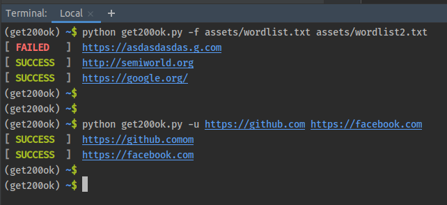

# Get 200 OK from URL List

Get website status ok from urls list



## Installation

```shell script
pip install -r requirements.txt
```

## Usage

**Commandline usage:**

1- Specify one ore multiple word list 
```shell script
python3 get200ok.py -f assets/wordlist.txt assets/wordlist2.txt
```

2- Specify one or multiple urls 
```shell script
python3 get200ok.py -u http://google.com https://youtube.com http://semiworld.org
```

**Api usage:**

```python
from get200ok import get200ok

urls = [
    "https://google.com",
    "asdfffe.com"
]
get200ok(url_list=urls)
```

## Test

```shell script
python -m unittest
```

## Licence

```
                    GNU GENERAL PUBLIC LICENSE
                       Version 3, 29 June 2007

 Copyright (C) 2007 Free Software Foundation, Inc. <https://fsf.org/>
 Everyone is permitted to copy and distribute verbatim copies
 of this license document, but changing it is not allowed.
```
